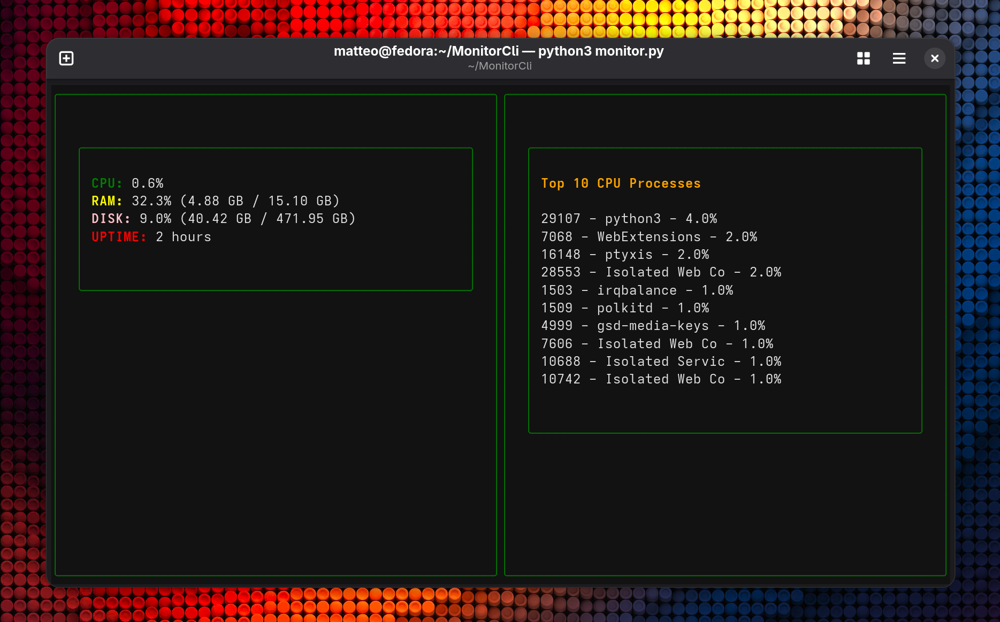

# System Monitor TUI
## Preview

Un monitor di sistema testuale scritto in Python utilizzando Textual, con pannelli dinamici per CPU, RAM, disco, uptime e processi.


## Funzionalità
- Utilizzo CPU
- Utilizzo RAM
- Utilizzo disco
- Uptime sistema
- Top 6 processi per CPU

## Tecnologie utilizzate
python3
Textual
psutil

## Installazione

```bash
python3 -m venv venv
source venv/bin/activate
pip install -r requirements
```
## Utilizzo

```bash
python3 monitor.py
```
Per uscire dal programma premere Ctrl + Q
